<h1 align="center">Hello there!</h1>

My name is Amanda and I'm graduated in System Analysis and Development. 💻

<h2>A little about me:</h2>

- 📍 My current areas of interest are mobile app development and web application.
- 📚 I’m currently focusing on learning NextJS and ReactJS.

- 💼 At the moment I'm working with front-end development.
- 🐰 Fun fact: I love bunnies!

<!-- 
 -->

 

### **Languages and Tools:**

    
    
    
    
    
    
    
    
    
    
    
    
    
    

### **Connect with me:**

&nbsp;&nbsp;

##

*NOTE: Top languages does not indicate my skill level or something like that, it's a github metric of which languages i have the most code on github, it's a new feature of [github-readme-stats](https://github.com/anuraghazra/github-readme-stats)*

