<h1 align="center">Welcome!</h1>

 

<h3>Hi there!</h3>
I'm Amanda, a front-end developer with 2 years of experience in software development. I graduated in Analysis and Systems Development and have a passion for creating user-friendly and visually appealing software. I'm proficient in a variety of programming languages and frameworks, and I'm always eager to learn new technologies.

 

<h3>Here's a little bit about me:</h3>

    · 📍 Currently, I'm interested in mobile app development and web applications. 
    · 📚 Right now, my main focus is on learning NextJS and ReactJS.
    · 💼 I'm currently working in the front-end development field.
    · 🐰 Fun fact: I absolutely adore bunnies!

         

